# 🌃 Hello — World!

**An ordinary builder weaving code in the vector space.**

  

## 🔨 Construction Sites (Public)
Here are the monoliths I'm currently laying bricks for:
- **[maestro-coding](https://github.com/redsunjin/maestro-coding)** — 코딩을 지휘하다: AI 에이전트와 함께하는 코드 심포니 🎼
- **[trunk_rag](https://github.com/redsunjin/trunk_rag)** — 폐쇄망/로컬 환경에서 사용하는 경량 RAG
- **[OpenCourse-TTS-Helper](https://github.com/redsunjin/OpenCourse-TTS-Helper)** — 온라인 학습 플랫폼 스크립트를 음성으로 읽어주는 브라우저 확장

> **[ 🔍 View More Public Repositories ](https://github.com/redsunjin?tab=repositories)**

📂 Closed Drawers (Private)

 
<i>Just a few messy drafts and quiet experiments. Though occasionally, a tiny secret slips out around the <code>atlas-</code> projects.</i>

